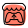

---

<table border="0" cellspacing="0" cellpadding="0">
<tr>
<td valign="top" width="60%">

## hanmi255

Game developer. Systems programmer. ACGN enthusiast.

Working primarily in C++, C#, GDScript across game and AI projects.

</td>
<td valign="top" width="40%" align="right">

<sub>STACK</sub>

```
C++  ·  C#  ·  GDScript  ·  JavaScript
Godot Engine  ·  Unity  ·  SDL3  ·  Python
```

</td>
</tr>
</table>

**Contact**

<table border="0" cellspacing="0" cellpadding="6">
<tr>
<td>
  <a href="mailto:hanmi2550505@gmail.com">
    
    &nbsp;hanmi2550505@gmail.com
  </a>
</td>
<td>&nbsp;&nbsp;</td>
<td>
  <a href="https://hanmi255.netlify.app/">
    
    &nbsp;Blog
  </a>
</td>
<td>&nbsp;&nbsp;</td>
<td>
  <a href="https://hanmi255.itch.io/">
    
    &nbsp;Itch.io
  </a>
</td>
<td>&nbsp;&nbsp;</td>
<td>
  <a href="https://space.bilibili.com/377044135">
    
    &nbsp;Bilibili
  </a>
</td>
<td>&nbsp;&nbsp;</td>
<td>
  <a href="https://2550505.com/space/10754">
    
    &nbsp;MG Club
  </a>
</td>
</tr>
</table>

---

<div align="center">

<picture>
  <source media="(prefers-color-scheme: dark)" srcset="https://raw.githubusercontent.com/hanmi255/hanmi255/output/github-contribution-grid-snake-dark.svg" />
  <source media="(prefers-color-scheme: light)" srcset="https://raw.githubusercontent.com/hanmi255/hanmi255/output/github-contribution-grid-snake-anthropic.svg" />
  
</picture>

</div>
